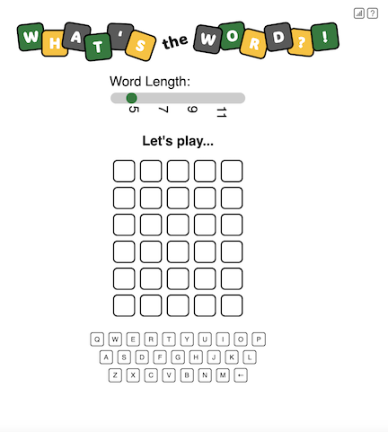
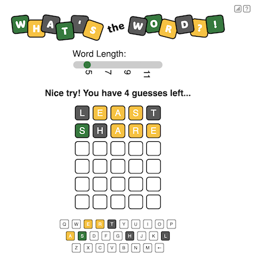
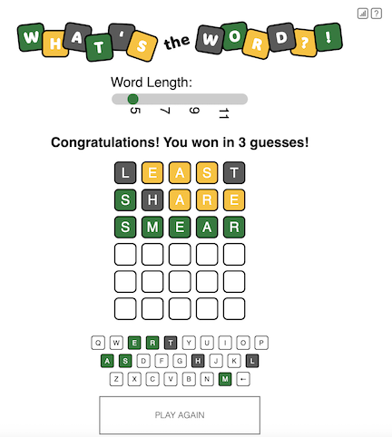
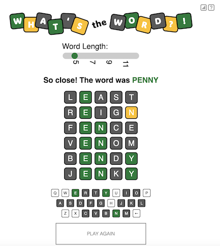
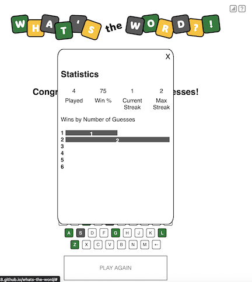
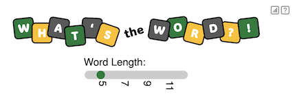

# What's the Word?!

## Overview
What's the Word?! is a version of Wordle that gives you six chances to guess a mystery word.  After each guess, you'll find out how close you are - letters in the correct spot will be green, letters in the word but in the wrong spot will be yellow, and letters not in the word at all will be white.  The shown keyboard will help you see what letters you haven't yet tried.  Can you figure out...What's the Word?! in time?? Good luck!

## User Stories
As a user, I want to...
  - click to start the game
  - enter word guess using computer keyboard
  - enter word guess using screen keyboard
  - see which letters I have used on screen keyboard
  - celebrate when I get a correct guess
  - be informed of letters in the correct spot
  - be informed of letters in the word but not the correct spot
  - be informed of correct answer when I run out of guesses
  - track the percentage of games I have won
  - track how many games I have won in a row (my current streak)
  - track the distribution of guesses it has taken me to win games
  - have the ability to play again
  - play words of different lengths

## Wireframes

Here is a screenshot of the game starting with an empty board, user entering the first word, and clicking "Guess"




This shot shows how the board will update as the user makes their first and second guesses



Here is a screenshot of the user guessing the correct word and winning!



Unfortunately, they may not guess the word every time so here's what will happen if they lose...



This is a view of the user's statistics for the current session.



If the user wants to challenge themselves, then can try different word lengths by using the slider



## Pseudocode

```js
// ===================================================== 
//  Define required constants:
//   - Master list of secret words
//   - Letter states: exact match, partial match, no match, unknown (not tried) with their associated background colors
//       = Exact Match ==> correct letter in the correct spot (green)
//       = Partial Match ==> correct letter in the wrong spot (yellow)
//       = No Match ==> letter not in secret word (grey)
//       = Unknown ==> letter has not been tried yet (white)
// ===================================================== 

// ===================================================== 
//  Identify and initialize state variables:
//   - Secret word
//   - Player object to hold stats
//   - Guesses array of arrays - store each letter separately to render easier
//   - Letters array - store current state of each letter
// ===================================================== 

// ===================================================== 
// Store elements that will be needed multiple times
//   - Guess button
//   - Play Again button
//   - Guess square divs
// ===================================================== 

// ===================================================== 
// Render the screen:
//   - Render the appropriate message (make a guess, you win, you lose)
//   - Render the guesses with the appropriate background color based on the guess's state (exact match, partial match, no match, unknown - not tried)
//   - Render the screen keyboard with the appropriate background color based on the letter's state (exact match, partial match, no match, unknown - not tried)
//   - Render the button: "GUESS" if user has more tries or "PLAY AGAIN" if they lost
// ===================================================== 

// ===================================================== 
// Handle Click of Screen "Keyboard" Buttons:
//   - Check if "letter" button clicked - if not, ignore click
//   - Capture "letter" of button clicked
//   - Call Handle Selected Letter (below) with letter clicked
// ===================================================== 

// ===================================================== 
// Handle Press of Keyboard
//   - Check if key pressed is a letter - if not, ignore press
//   - Capture "letter" of key pressed
//   - Call Handle Selected Letter (below) with letter pressed
// ===================================================== 

// ===================================================== 
// Handle Selected Letter
//   - Update current guess square state variable with letter clicked
//   - Advance to next letter square on current guess
//   - If no more empty squares on current guess, highlight "GUESS" button
//   - Render changes to screen
// ===================================================== 

// ===================================================== 
// Handle Click of "GUESS" button:
//   - Check for win - does guess equal mystery word
//   - If no win, for each letter in guess, 
//      = Check if letter at that spot is same as secret word at that spot.  If so, mark letter as "exact match"
//      = Check if letter at that spot is anywhere else in secret word.  If so, mark letter as "found but not exact match"
//      = Otherwise, mark letter as "not in secret word"
//   - Increment number of guesses
//   - If win or lose, update statistics
// ===================================================== 

// ===================================================== 
// Handle Click of "PLAY AGAIN" button:
//   - Reinitialize game
// ===================================================== 

// ===================================================== 
// Handle Click of "Stats" button:
//   - Display Number of Games Played
//   - Display Win %
//   - Display Current Streak
// ===================================================== 

// ===================================================== 
// Handle Click of "Help" button:
//   - Overlay the instructions on screen
// ===================================================== 
```


## Technologies Used
- HTML5
- CSS3
- JavaScript

##### Font
```css
font-family: Arial, Helvetica, sans-serif;
```

## Next Steps
As a user, I want to...
  - play more than one word at a time on different boards using same guesses
  - see statistics by word length
  - see statistics by word length and number of boards
  - enhance distribution bar chart in stats
  - better enable game from mobile device
  - allow unlimited guesses
  - require guesses to be actual words
  - make a hard version with more difficult secret words
  - play a daily "Word" against my friends
  - wager how many tries it will take me to guess secret word
  - not see repeated words frequently so the game should track when the words have been last used and pick the secret word accordingly
