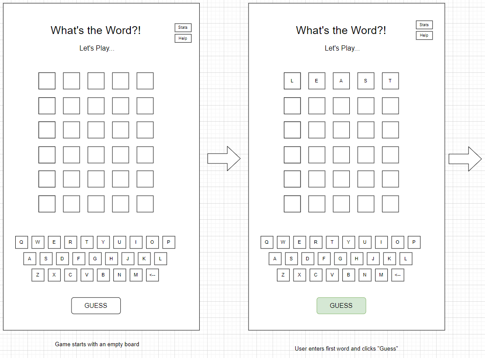

# What's the Word?!

## Overview
What's the Word?! is a version of Wordle that gives you six chances to guess a mystery 5-letter word.  After each guess, you'll find out how close you are - letters in the correct spot will be green, letters in the word but in the wrong spot will be yellow, and letters not in the word at all will be white.  The shown keyboard will help you see what letters you haven't yet tried.  Can you figure out...What's the Word?! in time?? Good luck!

## User Stories
As a user, I want to...
  - click to start the game
  - enter word guess using computer keyboard
  - enter word guess using screen keyboard
  - see which letters I have used on screen keyboard
  - celebrate when I get a correct guess
  - be informed of letters in the correct spot
  - be informed of letters in the word but not the correct spot
  - be informed of correct answer when I run out of guesses
  - track the percentage of games I have won
  - track how many games I have won in a row (my current streak)
  - have the ability to play again

## Wireframes

Here is a wireframe of the game starting with an empty board, user entering the first word, and clicking "Guess"



This wireframe shows how the board will update as the user makes their first and second guesses


Here is a wireframe of the user guessing the correct word and winning!


Unfortunately, they may not guess the word every time so here's what will happen if they lose...


Finally, this is a wireframe of the user's statistics for the current session.


## Pseudocode

```js
// ===================================================== 
//  Identify and initialize state variables:
//   - Set the secret word
// ===================================================== 

// ===================================================== 
// Render the screen:
//   - Render the appropriate message (make a guess, you win, you lose)
//   - Render the guesses with the appropriate background color based on the guess's state (exact match, in there somewhere, not in secret word, that guess hasn't been made yet)
//   - Render the screen keyboard with the appropriate background color based on the letter's state (exact match, in there somewhere, not in secret word, not used yet)
//   - Render the button: "GUESS" if user has more tries or "PLAY AGAIN" if they lost
// ===================================================== 

// ===================================================== 
// Handle Click of Screen "Keyboard" Buttons:
//   - Check if "letter" button clicked - if not, ignore click
//   - Capture "letter" of button clicked
//   - Call Handle Selected Letter (below) with letter clicked
// ===================================================== 

// ===================================================== 
// Handle Press of Keyboard
//   - Check if key pressed is a letter - if not, ignore press
//   - Capture "letter" of key pressed
//   - Call Handle Selected Letter (below) with letter pressed
// ===================================================== 

// ===================================================== 
// Handle Selected Letter
//   - Update current guess square state variable with letter clicked
//   - Advance to next letter square on current guess
//   - If no more empty squares on current guess, highlight "GUESS" button
//   - Render changes to screen
// ===================================================== 

// ===================================================== 
// Handle Click of "GUESS" button:
//   - Check for win - does guess equal mystery word
//   - If no win, for each letter in guess, 
//      = Check if letter at that spot is same as secret word at that spot.  If so, mark letter as "exact match"
//      = Check if letter at that spot is anywhere else in secret word.  If so, mark letter as "found but not exact match"
//      = Otherwise, mark letter as "not in secret word"
//   - Increment number of guesses
//   - If win or lose, update statistics
// ===================================================== 

// ===================================================== 
// Handle Click of "PLAY AGAIN" button:
//   - Reinitialize game
// ===================================================== 

// ===================================================== 
// Handle Click of "Stats" button:
//   - Display Number of Games Played
//   - Display Win %
//   - Display Current Streak
// ===================================================== 


// Handle Click of "Help" button:
//   - Overlay the instructions on screen
```


## Technologies Used
- HTML5
- CSS3
- JavaScript

##### Font
```css
font-family: Arial, Helvetica, sans-serif;
```

## Next Steps
As a user, I want to...
  - track how many guesses it has taken me to win games
